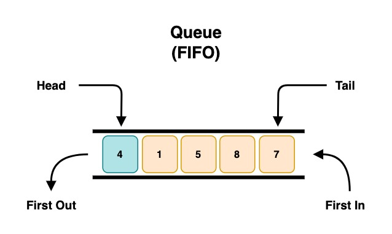
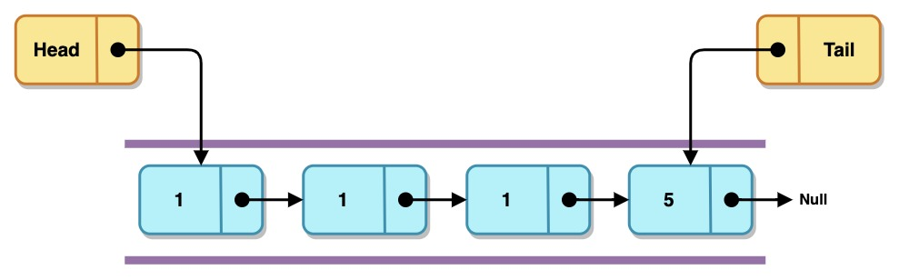
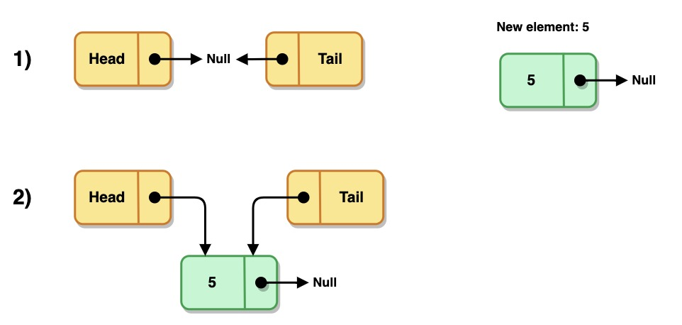
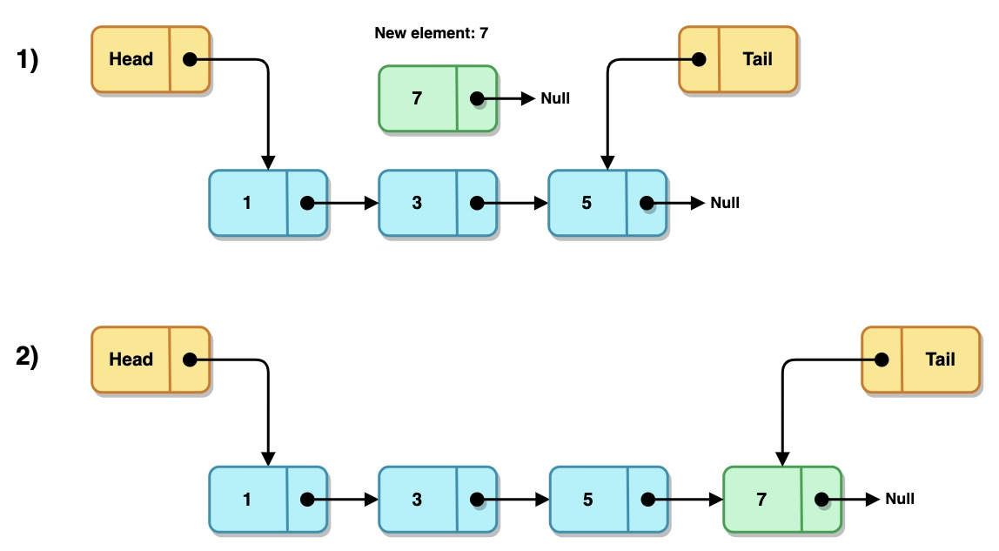
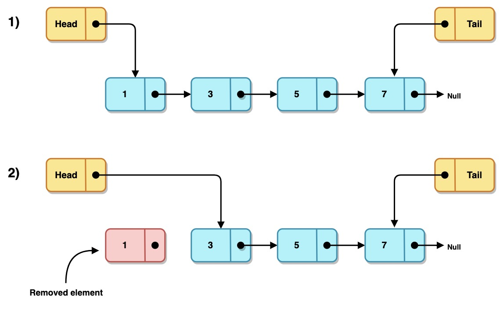
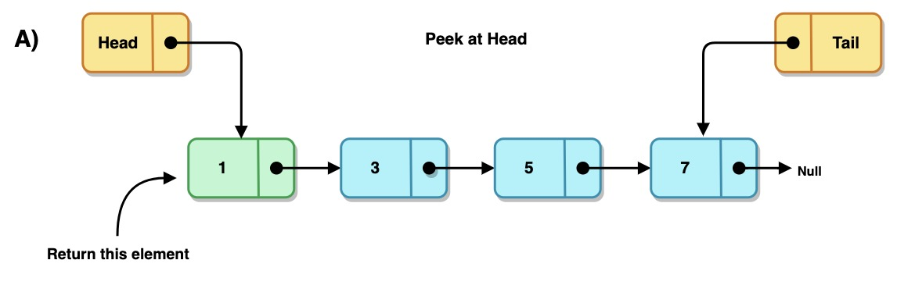
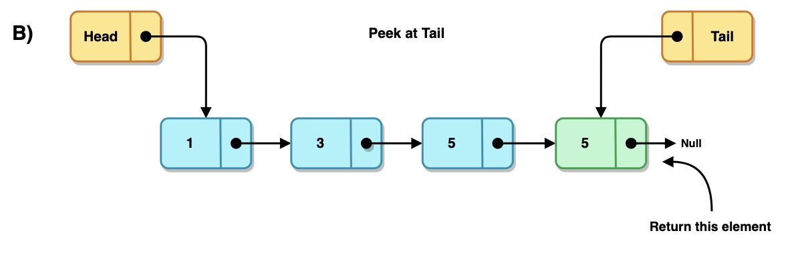
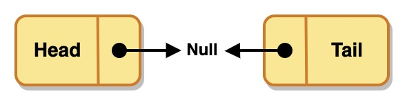

# Colas (Queues)

## Introducción

Una cola es una estructura de datos similiar a las listas enlazadas, con la diferencia
de que el acceso a los datos se realiza sólo por uno de los dos extremos de la lista.

Los elementos son insertados al final de la lista (cola) y son consumidos por
el frente (cabeza) de la lista.

Esta estructura de datos tambien es llamda FIFO (First In, First Out), ya que el
primer elemento que ingresa a la cola, es el primero en salir.

Las colas no existen como estructuras de datos estandar en los lengujes de programación,
este tipo de estructuras pueden ser representadas mediante el uso de arreglos
o listas enlazadas.

Una analogía que puede ejemplificar su comportamiento podría ser la cola en la
taquilla de un cine, en la que el primer cliente que llega será el primero en
ser atendido.

---

Al igual que las listas, las colas se representan mediante `nodos`, que almacenan los datos y la referencia hacia el elemento siguiente. La `cola` se conforma de un apuntador al inicio (`head`) y otro al final (`tail`) de la lista para facilitar las operaciónes de inserción y eliminación

---

## Operaciones sobre Colas

- [Inserción (Enqueue)](#inserción)
- [Eliminación (Dequeue)](#eliminación)
- [Consulta (Peek)](#consulta)
- [Borrado (Clear)](#borrado)
- [Ejercicios](#ejercicios)

--

## Inserción

| Complejidad   |        |
| :---          | :---:  |
| Constante     | `O(1)` |

Se consideran 2 casos para encolar un elemento:

- Caso 1: Cola vacía

- Caso 2: Cola no vacía

## Eliminación

| Complejidad   |        |
| :---          | :---:  |
| Constante     | `O(1)` |

Se consideran 2 casos para des-encolar un elemento:

- Caso 1: Cola vacía

        El proceso termina y devuelve nulo o error.

- Caso 2: Cola no vacía

## Consulta

| Complejidad   |        |
| :---          | :---:  |
| Constante     | `O(1)` |

La consulta se puede realizar tanto al inicio o al final de la cola, devolviendo el dato almacenado sin eliminar el nodo. Al igual que el des-encolado, existen dos
casos:

- Caso 1: Cola vacía

          El proceso termina y devuelve nulo o error.

- Caso 2:
  - A) Consulta al inicio (head)

     

  - B) Consulta al final (tail)

     

## Borrado

| Complejidad   |        |
| :---          | :---:  |
| Mejor caso    | `O(1)` |
| Peor caso     | `O(n)` |

El borrado consiste en eliminar todos los elementos de la cola y establecer los apuntadores de la cabeza y la cola a nulo.

# Ejercicios

| Problema                                                          | Dificultad |
|:---                                                               | :---:      |
| Comparar 2 Colas para conocer si son iguales                      | 😎         |
| Imprimir los elementos de la cola                                 | 😎         |
| Hacer una copia de una cola                                       | 😎         |
| Unir 2 colas, una al final de la segunda (join)                   | 😎         |
| Ontener el número de elementos de una cola (debe cumplir con `O(1)`)| 🤔         |