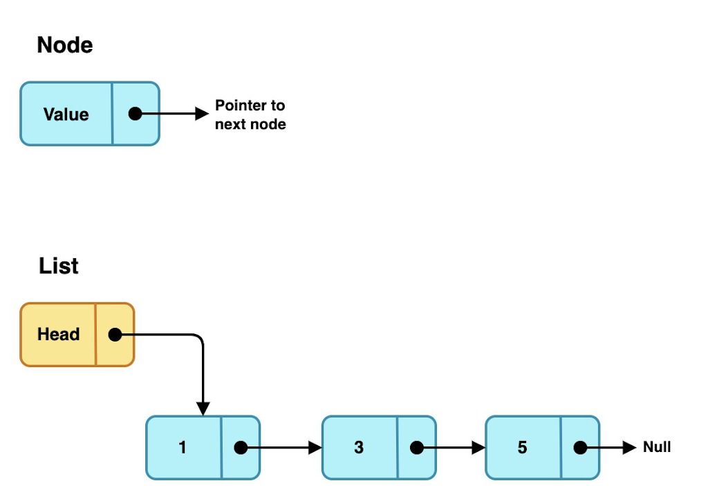
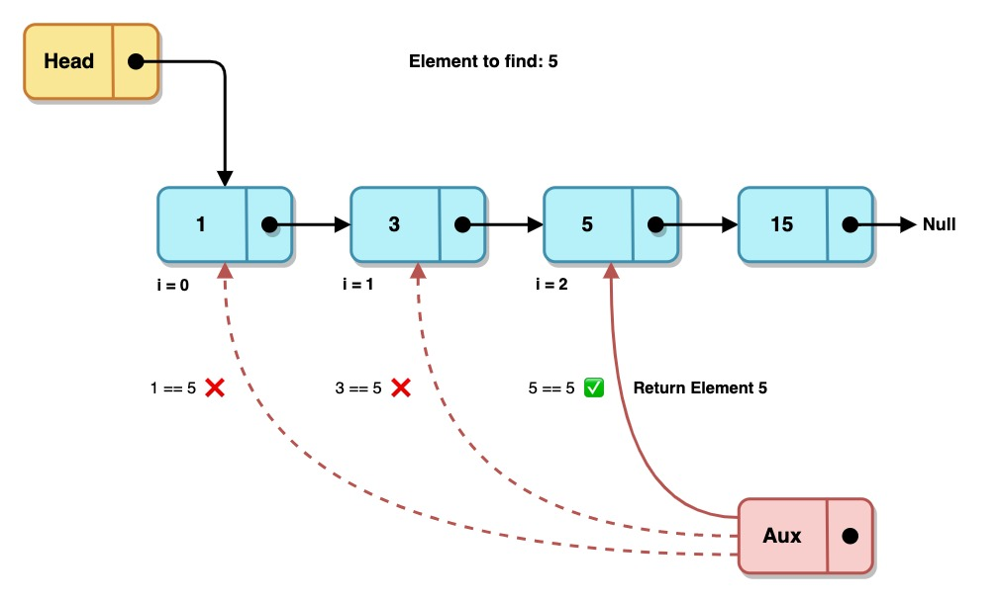
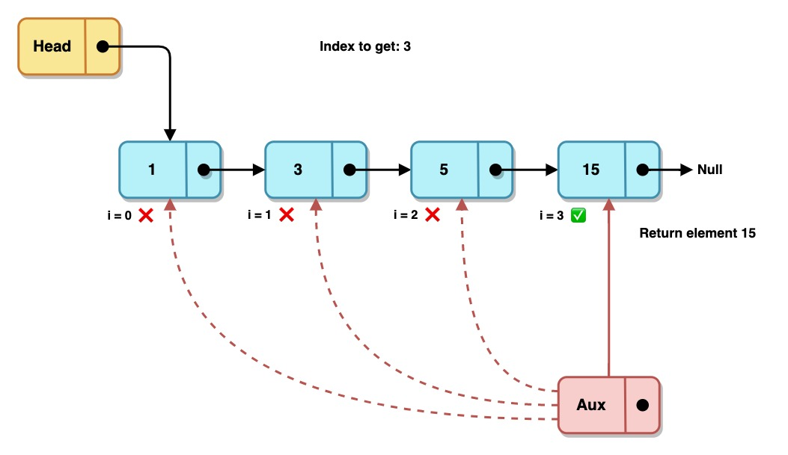
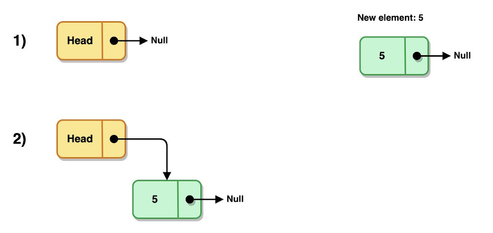
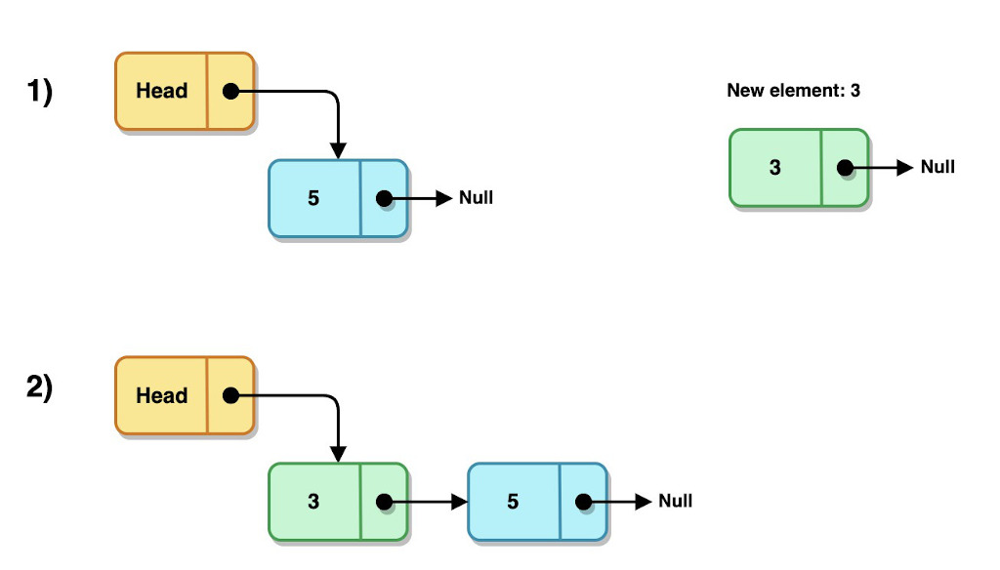
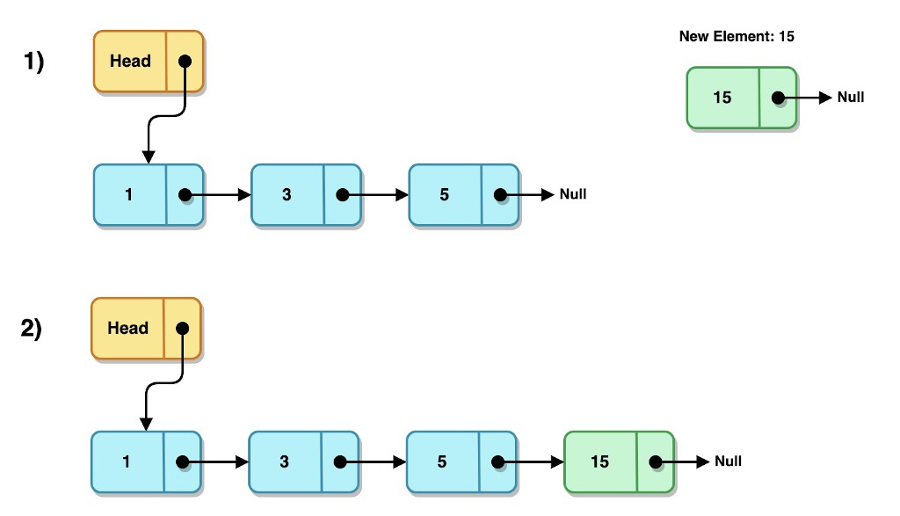
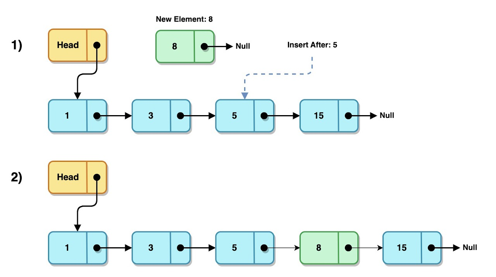
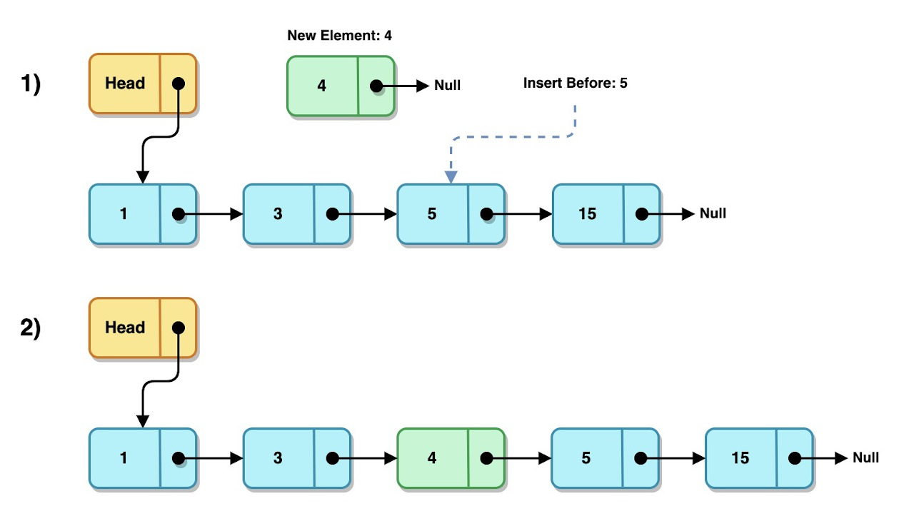
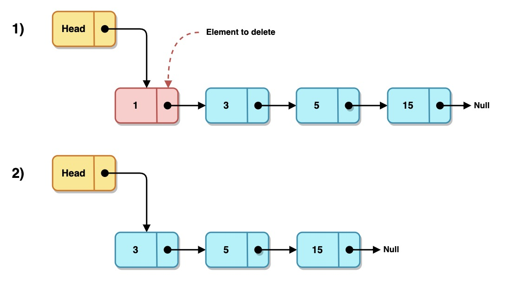
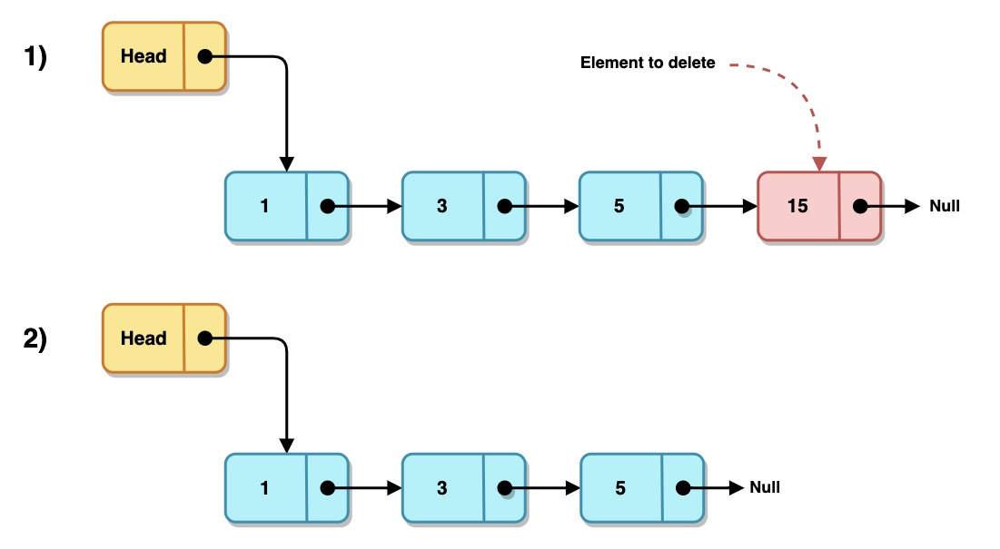

# Lista Enlazada Simple (Single Linked List)

## Descripción

En las ciencias de la computación y la programación las listas son unas de las estructuras de datos fundamentales y sencillas de implementar. A menudo son utilizadas como base para otras estructuras de datos más complejas.

Una lista enlazada es una colección lineal de elementos creados dinámicamente llamados Nodos. Lineal por que a cada elemento le puede seguir sólo otro elemento y dinámicas por que se puede manejar la memoria de manera flexible, sin necesidad de reservar una cantidad de memoria especifica anticipadamente.

Los `nodos` son los elementos que almacenan los datos y la referencia hacia el elemento siguiente, y la `lista` como tal es una referencia al primer nodo de la colección, también llamado `cabeza`.

---

## Operaciones sobre listas

### [Búsqueda](#búsqueda)
- [Buscar un elemento dado un valor](#búsqueda-de-un-elemento-dado-un-valor)
- [Buscar un elemento dado un índice](#búsqueda-de-un-elemento-dado-un-índice)

### [Inserción](#inserción)
- [Insertar un elemento al inicio de la lista](#inserción-al-inicio-de-la-lista)
- [Insertar un elemento al final de la lista](#inserción-al-final-de-la-lista)
- [Insertar un elemento después de otro elemento](#inserción-después-de-un-elemento)
- [Insertar un elemento antes de otro elemento](#inserción-antes-de-un-elemento)

### [Eliminación](#eliminación)
- [Eliminar el primer elemento de la lista](#eliminar-el-primer-elemento-de-la-lista)
- [Eliminar el último elemento de la lista](#eliminar-el-último-elemento-de-la-lista)

---

# Búsqueda

### Búsqueda de un elemento dado un valor
| Complejidad   |        |
| :---          | :---:  |
| Mejor caso    | `O(1)` |
| Peor caso     | `O(n)` |

Se consideran 3 casos para realizar una `búsqueda` de un elemento de una lista dado su `valor`:

- Caso 1: Lista vacía

        La búsqueda finaliza inmediatamente y devuelve nulo.

- Caso 2: El elemento a buscar no existe en la lista

        Se devuelve un valor nulo.

- Caso 3: El elemento a buscar si existe en la lista

---
### Búsqueda de un elemento dado un índice
| Complejidad   |        |
| :---          | :---:  |
| Mejor caso    | `O(1)` |
| Peor caso     | `O(n)` |

Se consideran 3 casos para realizar una `búsqueda` de un elemento de una lista dado su `índice`:

- Caso 1: Lista vacía

        La búsqueda finaliza inmediatamente y devuelve un valor nulo.

- Caso 2: El elemento a buscar no existe en la lista

        Se devuelve un valor nulo.

- Caso 3: El índice a buscar si existe en la lista

# Inserción

### Inserción al inicio de la lista

| Complejidad   |        |
| :---          | :---:  |
| Constante     | `O(1)` |

Se consideran 2 casos para la inserción `al inicio` de una lista:

- Caso 1: Lista vacía

- Caso 2: Lista no vacía

---

### Inserción al final de la lista

| Complejidad   |        |
| :---          | :---:  |
| Mejor caso    | `O(1)` |
| Peor caso     | `O(n)` |

Al igual que la inserción al inicio, la inserción `al final` presenta los mismos 2 casos:

- Caso 1: Lista vacía

- Caso 2: Lista no vacía

---

### Inserción después de un elemento

| Complejidad   |        |
| :---          | :---:  |
| Mejor caso    | `O(1)` |
| Peor caso     | `O(n)` |

Se consideran 3 casos para la inserción de un elemento `después` de otro elemento dado de una lista:

- Caso 1: Lista vacía

        El nuevo elemento no se inserta en la lista.

- Caso 2: El elemento a buscar no existe en la lista

        El nuevo elemento no se inserta en la lista.

- Caso 3: El elemento a buscar si existe en la lista

---

### Inserción antes de un elemento

| Complejidad   |        |
| :---          | :---:  |
| Mejor caso    | `O(1)` |
| Peor caso     | `O(n)` |

Se consideran 3 casos para la inserción de un nuevo element `antes` de otro elemento dado de una lista:

- Caso 1: Lista vacía

        El nuevo elemento no se inserta en la lista.

- Caso 2: El elemento a buscar no existe en la lista

        El nuevo elemento no se inserta en la lista.

- Caso 3: El elemento a buscar si existe en la lista

---

# Eliminación

### Eliminar el primer elemento de la lista
| Complejidad   |        |
| :---          | :---:  |
| Constante    | `O(1)` |

Se consideran 2 casos para la eliminación del primer elemento de una lista:

- Caso 1: Lista vacía

        Se devuelve un valor nulo.

- Caso 2: La lista no está vacía
  
---

### Eliminar el último elemento de la lista
| Complejidad   |        |
| :---          | :---:  |
| Constante    | `O(1)` |

Se consideran 3 casos para la eliminación del primer elemento de una lista:

- Caso 1: Lista vacía

        Se devuelve un valor nulo.

- Caso 2: La lista contiene sólo un lemento

  - Se realiza la operación de [eliminar el primer elemento de la lista](#eliminar-el-primer-elemento-de-la-lista)

- Caso 3: La lista contiene más de 1 elemento

# Ejercicios

| Problema                                                          | Dificultad |
|:---                                                               | :---:      |
| Comparar 2 listas para conocer si son iguales                     | 😎         |
| Imprimir la lista en orden ascendente                             | 😎         |
| Eliminar todos los elementos de una lista                         | 😎         |
| Ontener el número de elementos de una lista                       | 😎         |
| Mover el primer elemento de una lista al final (shift left)       | 😎         |
| Mover el último elemento de una lista al inicio (shift right)     | 🤔         |
| Imprimir la lista en orden descendente                            | 🤔         |
| Unir 2 listas, una al final de la segunda (join)                  | 🤔         |
| Obtener el número de elementos de una lista que cumpla con `O(1)` | 🤔         |
| Dividir una lista por la mitad y devolver las 2 sub-listas        | 🤔         |
| Hacer la [Unión, Intersección y Diferencia](https://es.wikipedia.org/wiki/%C3%81lgebra_de_conjuntos) de 2 listas | 🥵         |
| Mejorar la inserción al final para que cumpla con `O(1)`          | 🥵         |
| Invertir los elementos de una lista (reverse)                     | 🥵         |