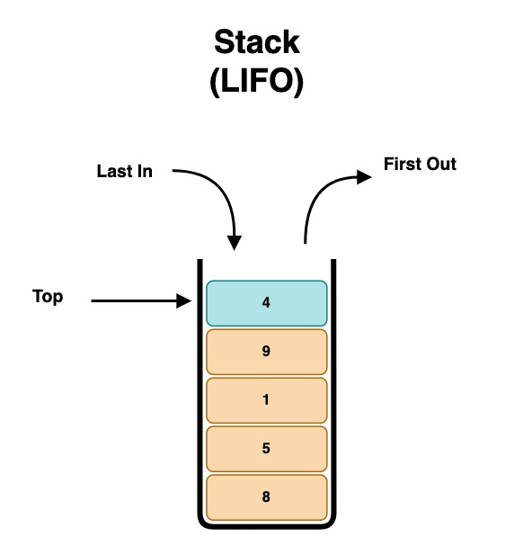
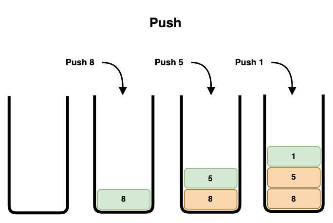
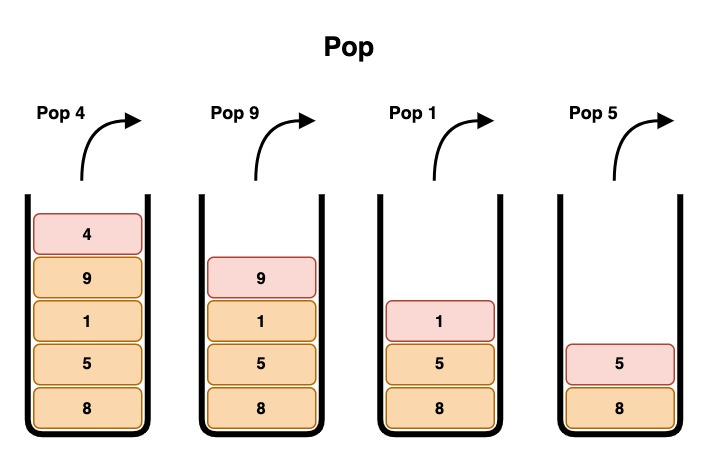
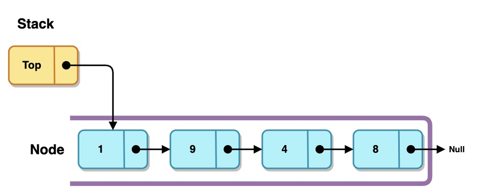
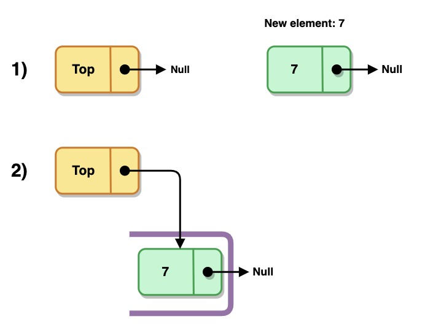
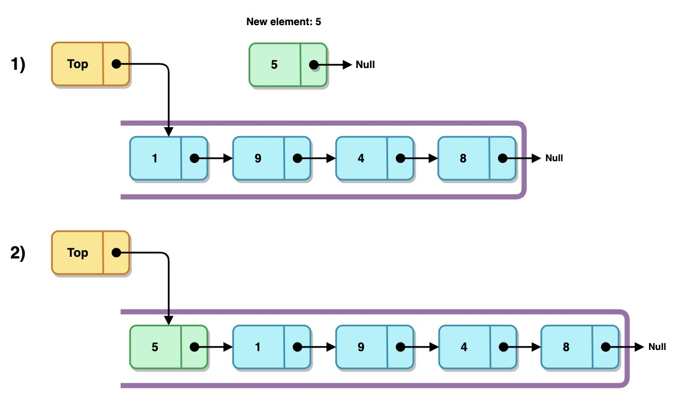
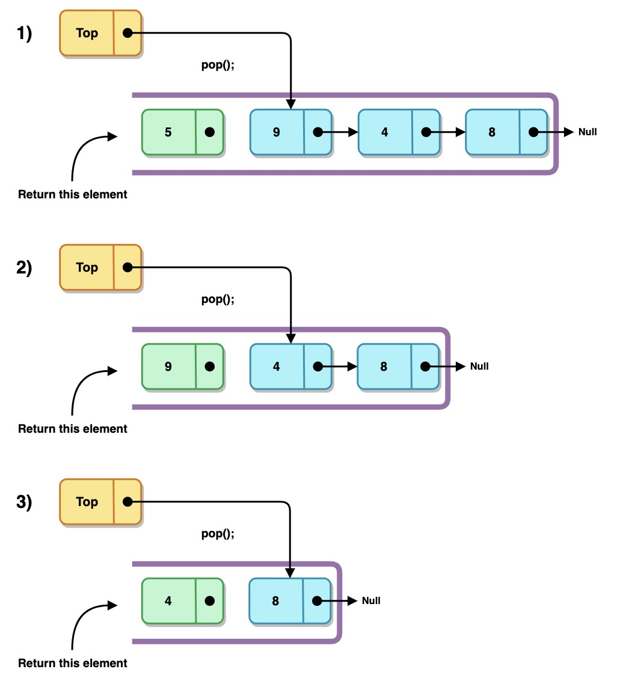
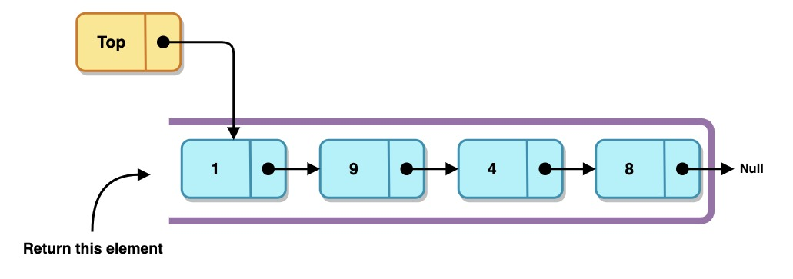
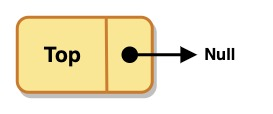

# Pila (Stack)

## Introducción

Una pila es una estructura de datos de entradas ordenadas, teniendo como característica que los elementos son insertados y consumidos por un mismo extremo de la lista.

Los nuevos elementos son insertados y consumidos al inicio de la lista (tope).

Esta estructura de datos tambien es llamda LIFO (Lasi In, First Out), ya que el primer elemento que ingresa a la pila, es el último en salir.

Las Pilas al igual que las Colas no existen como estructuras de datos estandar en los lengujes de programación, este tipo de estructuras pueden ser representadas mediante el uso de arreglos o listas enlazadas.

Una analogía que puede ejemplificar su comportamiento podría ser una pila de platos en un restaurante, en la que el último plato lavado y apilado es el primero utilizado para servir un nuevo platillo.

---

Al igual que las listas, las pilas pueden ser representan mediante `nodos`, que almacenan los datos y la referencia hacia el elemento siguiente. La `pila` se conforma de un único
apuntador al inicio (`tope`), lo que hace muy sencillo la inserción y eliminación de elementos.

---

## Operaciones sobre Pilas

- [Inserción (Push)](#inserción)
- [Eliminación (Pop)](#eliminación)
- [Consulta (Peek)](#consulta)
- [Borrado (Clear)](#borrado)
- [Ejercicios](#ejercicios)

--

## Inserción

| Complejidad   |        |
| :---          | :---:  |
| Constante     | `O(1)` |

La inserción en una pila (**`Push`**) es la misma para los casos de pila vacía y no vacía:

- Pila vacía
  

- Pila No vacía
  

## Eliminación

| Complejidad   |        |
| :---          | :---:  |
| Constante     | `O(1)` |

La eliminación en una pila (**`Pop`**) considera 2 casos:

- Caso 1: Pila vacía

          El proceso termina y devuelve nulo o error.

- Caso 2: Pila no vacía

  

## Consulta

| Complejidad   |        |
| :---          | :---:  |
| Constante     | `O(1)` |

La consulta en una pila (**`Peek`**) devuelve el valor del tope sin eliminar el nodo; considera 2 casos:

- Caso 1: Pila vacía

          El proceso termina y devuelve nulo o error.

- Caso 2: Pila no vacía

  

## Borrado

| Complejidad   |        |
| :---          | :---:  |
| Mejor caso    | `O(1)` |
| Peor caso     | `O(n)` |

El borrado consiste en eliminar todos los elementos de la cola y establecer los apuntadores de la cabeza y la cola a nulo.

# Ejercicios

| Problema                                                          | Dificultad |
|:---                                                               | :---:      |
| Comparar 2 pilas para conocer si son iguales                      | 😎         |
| Imprimir los elementos de la pila                                 | 😎         |
| Hacer una copia de una pila                                       | 😎         |
| Unir 2 pilas, una al final de la segunda (join)                   | 😎         |
| Ontener el número de elementos de una pila (debe cumplir con `O(1)`)| 🤔         |